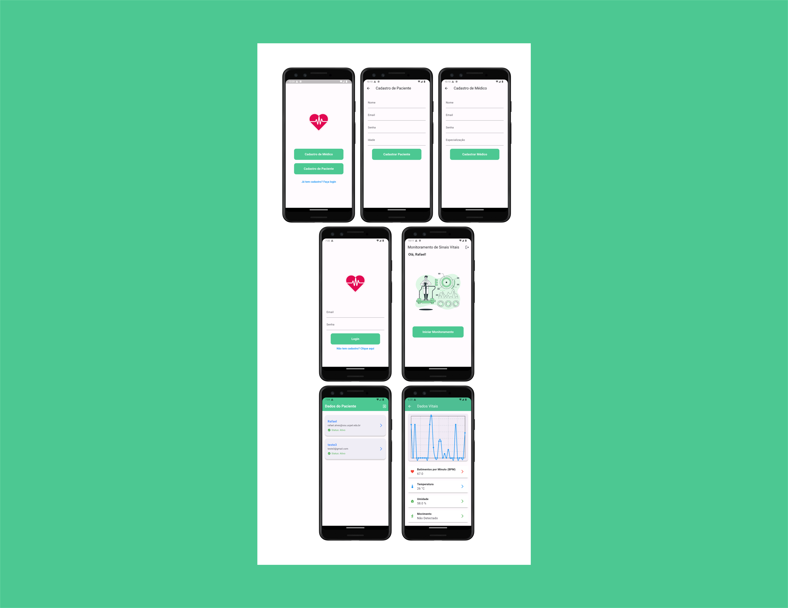

# MoniCare

**MoniCare** é uma abordagem de **monitoramento remoto de pacientes de baixo custo**, baseada em **Internet das Coisas (IoT)**, desenvolvida para auxiliar profissionais de saúde no acompanhamento contínuo de sinais fisiológicos e condições ambientais dos pacientes.

O projeto busca explorar uma alternativa de **baixo custo para monitoramento remoto**, especialmente útil em cenários nos quais o acompanhamento presencial contínuo pode ser limitado, como áreas remotas, dificuldades de locomoção ou restrições de acesso à hospitalização.

A solução utiliza **sensores** para coletar dados fisiológicos e ambientais, processados por um **microcontrolador** e transmitidos via **Wi-Fi** para armazenamento em um **banco de dados em nuvem**.

Os dados coletados podem ser visualizados em tempo real por profissionais de saúde por meio de um **aplicativo móvel desenvolvido com Dart e Flutter**, permitindo um acompanhamento remoto e contínuo dos pacientes.

## Screenshots

### Login Page

### Sensors Data Page

### All Screens

